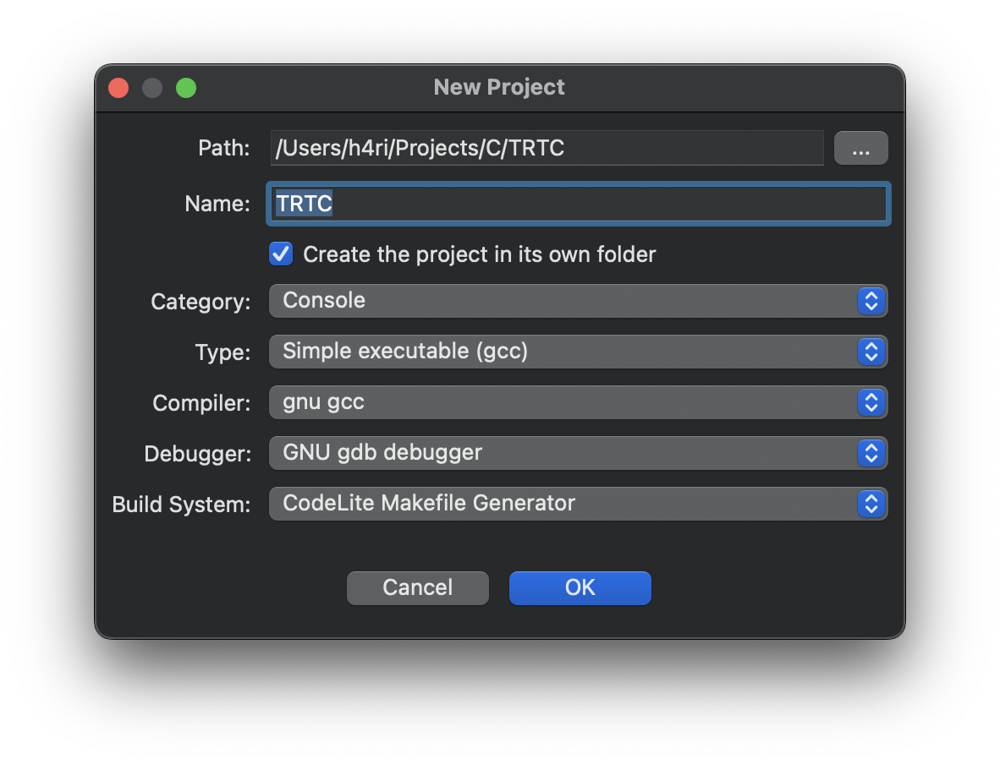
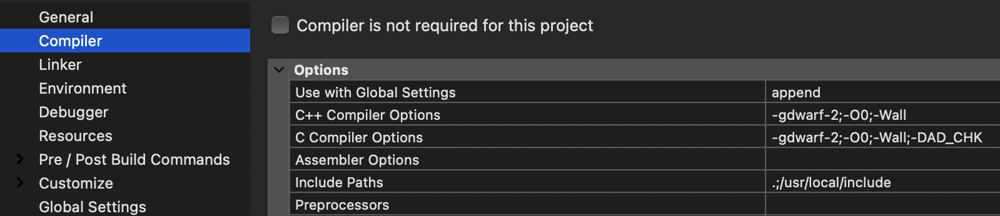

# The Ray Tracer Challenge

Implementation of ["The Ray Tracer Challenge" book](https://pragprog.com/titles/jbtracer/the-ray-tracer-challenge/) by Jamis Buck in C.

**OS:** macOS Sonoma

**DevEnv:** CodeLite

## Setup (macOS)

- [Install CodeLite](https://codelite.org)

- [Install SDL2](https://formulae.brew.sh/formula/sdl2) (`brew install sdl2`)

- Create C++ workspace in CodeLite

- Create new project in workspace
  

- Set paths and libs in project settings

  

- Enjoy

**Current 'C compiler options' for Debug:** -gdwarf-2;-O0;-std=c11;-Wall;-Winline;-pedantic;-DAD_CHK

## Progress

- [x] Chapter One: Tuples, Points, and Vectors
  - [x] Tuples
  - [x] Operations
  - [x] Putting It Together
- [x] Chapter 2: Drawing on a Canvas
  - [x] Representing Colors
  - [x] Implementing Color Operations
  - [x] Creating a Canvas
  - [x] Saving a Canvas
  - [x] Putting It Together
- [x] Chapter 3: Matrices
  - [x] Creating a Matrix
  - [x] Multiplying Matrices
  - [x] The Identity Matrix
  - [x] Transposing Matrices
  - [x] Inverting Matrices
  - [x] Putting It Together
- [ ] Chapter 4: Matrix Transformations
  - [x] Translation
  - [x] Scaling
  - [x] Rotation
  - [x] Shearing
  - [x] Chaining Transformations
  - [x] Putting It Together
- [ ] Chapter 5: Ray-Sphere Intersections
  - [ ] Creating Rays
  - [ ] Intersecting Rays with Spheres
  - [ ] Tracking Intersections
  - [ ] Identifying Hits
  - [ ] Transforming Rays and Spheres
  - [ ] Putting It Together
- [ ] Chapter 6: Light and Shading
  - [ ] Surface Normals
  - [ ] Reflecting Vectors
  - [ ] The Phong Reflection Model
  - [ ] Putting It Together